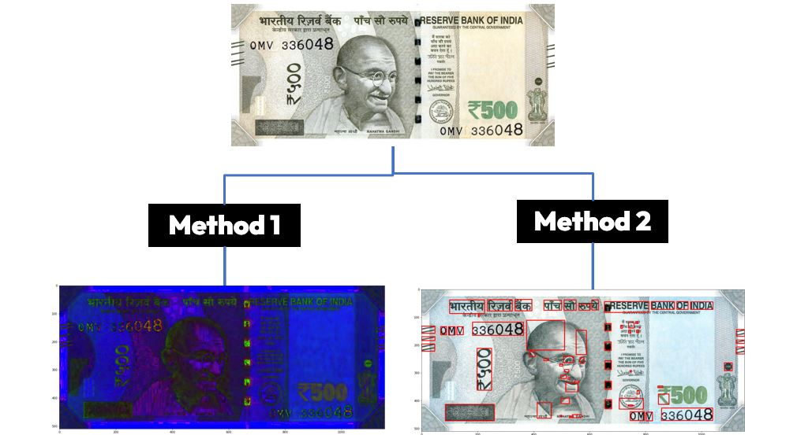

# Fake-Currency-Detection-Using-Digital-Image-Processing
 
## Introduction
Fake currency is a significant issue faced by financial institutions and individuals worldwide. Counterfeit money can have severe economic consequences, leading to financial losses and undermining the trust in the monetary system. To combat this problem, digital image processing techniques can be employed to detect fake currency notes.
This project aims to develop a system that leverages digital image processing algorithms to detect counterfeit currency especially **(Indian 500-rupee note)**. By analyzing various features and patterns on currency notes.

## Methodology
The methodology consists of **2** methods and there are some limitations on the image that should be captured in **good light** with **high resolution** and **not tilted**.

### Method 1: UltraViolet effect
The first method in the fake currency detection process is simulating the **ultraviolet effect** on the fake image. 
This method is based on this [Paper](https://www.researchgate.net/publication/365977982_COUNTERFEIT_CURRENCY_DETECTION_USING_IMAGE_PROCESSING).
The following steps are followed in this method:

1. Convert the Image to HSV Color Space
2. Apply Histogram Equalization on The Image
3. Compare the mean saturation of the current Image with the reference image

### Method 2: Feature Extraction
The first method in the fake currency detection process is **extracting features** from the Current image and comparing them with the extracted features of the reference Image.
The features that we have focused on are **(Blendlines, Serial number & Font size).**
The following steps are followed in this method:

1. Convert the Image to gray Color Space
2. use the canny detector to detect edges
3. Apply Closing to connect objects to each other
4. Apply Region filling
5. Apply Edge-based segmentation

There are More details about the methodology illustrated in the presentation file.

### Results

According to human observation and testing the program has a **good** result. However, more data are required to be apple to measure the error using a **metric** and to better **tune the Thresholds**.

### How to use it

just download the code.py file and import the required libraries and run it on the python editor.

### References
- https://www.researchgate.net/publication/365977982_COUNTERFEIT_CURRENCY_DETECTION_USING_IMAGE_PROCESSING
- https://iopscience.iop.org/article/10.1088/1757-899X/263/5/052047
- https://ijcsmc.com/docs/papers/April2019/V8I4201914.pdf
- https://www.mintageworld.com/knowledge-base/security-features-on-current-banknotes/

